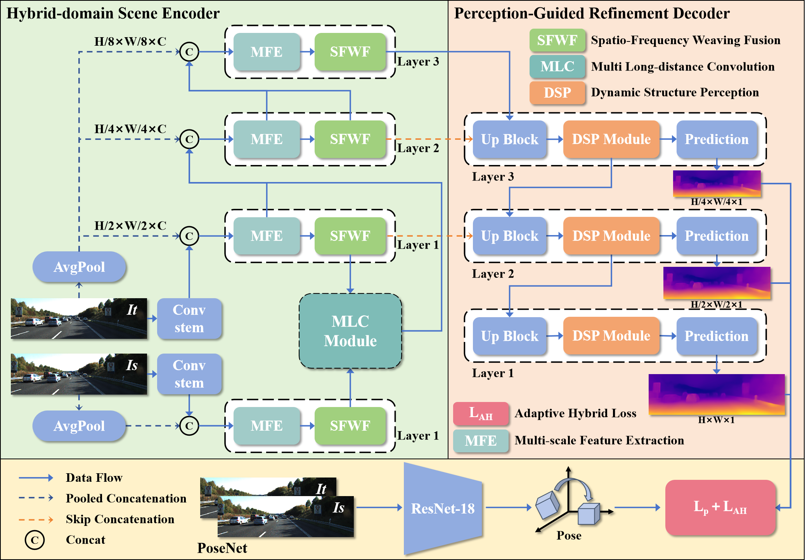

# ASPDepth: Enhancing Adaptive Scene Perception for Self-Supervised Monocular Depth Estimation via Cross-frame Spectrum and Structural Priors

The code for this work will be released upon acceptance.

